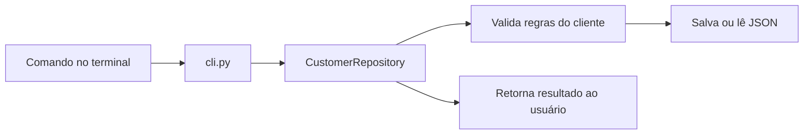

<p align="center">
  <h1 align="center">Cadastro de Clientes com TDD</h1>
  <p align="center">
    Um CRUD de clientes em Python, criado para demonstrar TDD com testes automatizados, persistência em JSON e uso pelo terminal.
  </p>
</p>

<p align="center">
  
  
  
  
</p>

---

## O que este projeto faz

Este projeto implementa um cadastro de clientes simples, mas completo o bastante
para mostrar o ciclo de TDD na prática. Ele permite cadastrar, listar, consultar,
atualizar e remover clientes pelo terminal.

Foi feito para uma atividade acadêmica de Engenharia de Software, com foco em
testes antes da implementação e organização clara do código.

## Sumário

- [Demonstração rápida](#demonstração-rápida)
- [Como funciona](#como-funciona)
- [Funcionalidades](#funcionalidades)
- [Instalação e execução](#instalação-e-execução)
- [Testes](#testes)
- [Estrutura do projeto](#estrutura-do-projeto)
- [Documentação técnica](#documentação-técnica)

## Demonstração rápida

```powershell
$env:PYTHONPATH = "$PWD\src"

python -m customer_crud.cli --db data/customers.json add `
  --name "Ana Silva" `
  --email "ana@example.com" `
  --phone "71999990000"
```

Saída esperada:

```text
Cliente 1 cadastrado: Ana Silva
```

Listando os clientes:

```powershell
python -m customer_crud.cli --db data/customers.json list
```

```text
1 | Ana Silva | ana@example.com | 71999990000
```

## Como funciona



A interface de linha de comando recebe a ação do usuário e chama o repositório.
O repositório concentra as regras do CRUD, valida os dados e grava os clientes
em um arquivo JSON quando um caminho é informado com `--db`.

## Funcionalidades

| Recurso | O que acontece |
| --- | --- |
| Cadastro | Cria cliente com `id`, nome, e-mail e telefone |
| Listagem | Mostra todos os clientes em ordem de cadastro |
| Consulta | Busca cliente pelo identificador |
| Atualização | Altera nome, e-mail ou telefone preservando o mesmo `id` |
| Remoção | Exclui o cliente informado |
| Validação | Recusa nome vazio, e-mail inválido e e-mail repetido |
| Persistência | Salva os dados em JSON |

## Instalação e execução

Requisito:

```text
Python 3.10 ou superior
```

O projeto não precisa de pacotes externos.

Antes de executar os comandos, configure o caminho do código fonte:

```powershell
$env:PYTHONPATH = "$PWD\src"
```

Cadastrar:

```powershell
python -m customer_crud.cli --db data/customers.json add --name "Ana Silva" --email "ana@example.com" --phone "71999990000"
```

Listar:

```powershell
python -m customer_crud.cli --db data/customers.json list
```

Consultar:

```powershell
python -m customer_crud.cli --db data/customers.json show 1
```

Atualizar:

```powershell
python -m customer_crud.cli --db data/customers.json update 1 --name "Ana Costa" --email "ana.costa@example.com"
```

Remover:

```powershell
python -m customer_crud.cli --db data/customers.json delete 1
```

## Testes

A ferramenta de testes usada é o `unittest`, que já vem com o Python. Essa
escolha mantém o projeto fácil de rodar em qualquer máquina, sem instalar
dependências.

Execute a suíte:

```powershell
$env:PYTHONPATH = "$PWD\src"
python -m unittest discover -s tests
```

Saída esperada:

```text
Ran 7 tests

OK
```

Os testes cobrem:

| Arquivo | Cobertura |
| --- | --- |
| `tests/test_customer_repository.py` | CRUD, validações e persistência |
| `tests/test_cli.py` | Fluxo de cadastro e listagem pela CLI |

## Estrutura do projeto

```text
src/customer_crud/
  __init__.py
  cli.py
  models.py
  repository.py

tests/
  test_cli.py
  test_customer_repository.py

docs/
  codigo-fonte.md
```

## Documentação técnica

Para detalhes sobre módulos, regras de negócio, persistência e relação com TDD,
consulte:

[docs/codigo-fonte.md](docs/codigo-fonte.md)

Para abrir pelo terminal:

```powershell
Get-Content docs\codigo-fonte.md
```


